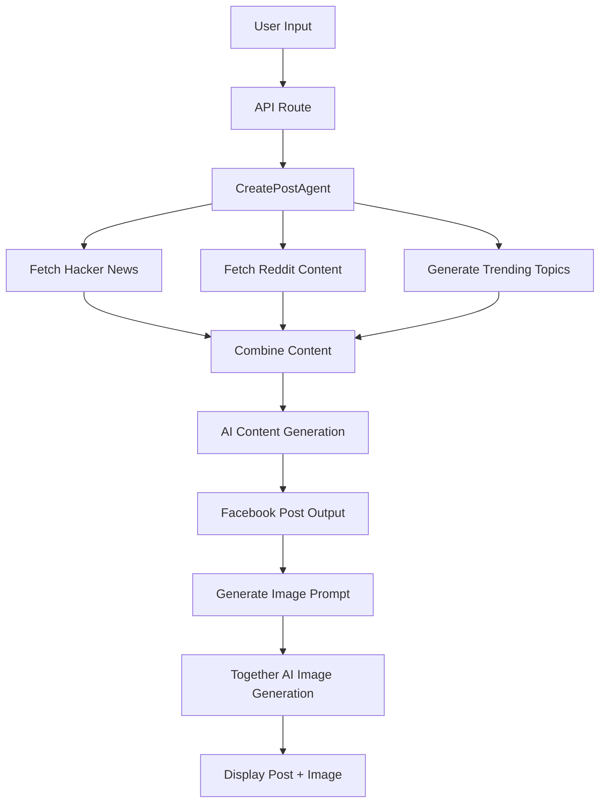

# 🚀 ABC Automation - AI-Powered Social Media Content Generator

> Transform trending topics into engaging Facebook posts with AI-generated content and custom thumbnail images

[](https://nextjs.org/)
[](https://www.typescriptlang.org/)
[](https://langchain.com/)
[](https://tailwindcss.com/)

## ✨ Features

- 🔥 **Real-time Trend Analysis** - Automatically fetches trending topics from Hacker News, Reddit, and more
- 🤖 **AI-Powered Content Generation** - Creates engaging Facebook posts using advanced language models
- 🎨 **AI Image Generation** - Generates custom thumbnail images using FLUX.1 model via Together AI
- 📊 **Multi-Source Data Integration** - Combines insights from multiple trending content sources
- 💡 **Smart Prompt Engineering** - Uses AI to create optimal image generation prompts
- � **Beautiful UI** - Clean, modern interface built with Tailwind CSS
- ⚡ **Fast & Reliable** - Built on Next.js 15 with optimized performance
- 🔒 **Environment-Safe** - Secure API key management and error handling

## 🛠️ Tech Stack

| Technology       | Purpose                                    | Version |
| ---------------- | ------------------------------------------ | ------- |
| **Next.js**      | Full-stack React framework                 | 15.4.5  |
| **TypeScript**   | Type-safe development                      | 5.x     |
| **LangChain**    | AI/LLM integration framework               | 0.3.x   |
| **OpenRouter**   | Multi-model LLM API access                 | Latest  |
| **Together AI**  | AI image generation with FLUX.1 model      | Latest  |
| **Tailwind CSS** | Utility-first CSS framework                | 4.x     |
| **pnpm**         | Fast, disk space efficient package manager | Latest  |

## 🚀 Quick Start

### Prerequisites

- Node.js 18+
- pnpm (recommended) or npm
- OpenRouter API key
- Together AI API key (for image generation)

### Installation

1. **Clone the repository**

   ```bash
   git clone https://github.com/yourusername/abc-automation.git
   cd abc-automation
   ```

2. **Install dependencies**

   ```bash
   pnpm install
   ```

3. **Set up environment variables**

   ```bash
   cp .env.example .env.local
   ```

   Add your API keys to `.env.local`:

   ```env
   OPENROUTER_API_KEY=your_openrouter_api_key_here
   TOGETHER_API_KEY=your_together_ai_api_key_here
   ```

4. **Run the development server**

   ```bash
   pnpm dev
   ```

5. **Open your browser**
   Navigate to [http://localhost:3000](http://localhost:3000)

## 📖 How It Works



### Content Sources

- **🔥 Hacker News API** - Latest tech discussions and trending stories
- **📱 Reddit Programming** - Community-driven programming discussions
- **📈 Trending Topics** - AI-generated related trending subjects

### AI Models & Services

The application uses multiple AI services for different tasks:

#### Content Generation

- **DeepSeek R1** (via OpenRouter) for:
  - Content analysis and synthesis
  - Trend identification
  - Engaging social media copy generation
  - Hashtag suggestions and call-to-action creation

#### Image Generation

- **FLUX.1-schnell-Free** (via Together AI) for:

  - Custom thumbnail image generation
  - Smart prompt engineering for optimal image results
  - Fast, high-quality image synthesis

- **🔥 Hacker News API** - Latest tech discussions and trending stories
- **📱 Reddit Programming** - Community-driven programming discussions
- **📈 Trending Topics** - AI-generated related trending subjects

### AI Models

The application uses **DeepSeek R1** through OpenRouter for:

- Content analysis and synthesis
- Trend identification
- Engaging social media copy generation
- Hashtag suggestions and call-to-action creation

## 🎯 Usage

1. **Enter a Topic**: Type any subject you want to create content about
2. **AI Analysis**: The system fetches real-time data from multiple sources
3. **Content Generation**: AI analyzes trends and creates an engaging Facebook post
4. **Image Generation**: AI creates a custom thumbnail image based on the post content
5. **Ready to Share**: Get a polished post with image, hashtags, and call-to-action

### Example Input/Output

**Input:** `"React hooks"`

**Text Output:**

```
🚀 React Hooks are revolutionizing how we build components!

The latest discussions show developers are loving the simplicity of useState and useEffect for state management. With 847 upvotes on the latest Hacker News thread, it's clear that hooks are here to stay!

✨ Key benefits:
- Cleaner, more readable code
- Better state logic reuse
- Easier testing and debugging

Ready to upgrade your React skills?

#ReactHooks #JavaScript #WebDevelopment #FrontendDev #ReactJS #Programming
```

**Image Output:** Custom AI-generated thumbnail showing React components and hooks concept

✨ Key benefits:

- Cleaner, more readable code
- Better state logic reuse
- Easier testing and debugging

Ready to upgrade your React skills?

#ReactHooks #JavaScript #WebDevelopment #FrontendDev #ReactJS #Programming

```

## 📁 Project Structure

```

abc-automation/
├── app/
│ ├── api/
│ │ ├── automate/
│ │ │ └── route.ts # Main content generation API
│ │ └── imageGen/
│ │ └── route.ts # Image generation API
│ ├── globals.css # Global styles
│ ├── layout.tsx # App layout
│ └── page.tsx # Homepage/form
├── lib/
│ ├── functions/
│ │ ├── CreatePostAgent.ts # Main AI content agent
│ │ ├── GenerateImage.ts # AI image generation
│ │ ├── FetchHackerNews.ts # Hacker News API
│ │ ├── FetchReddit.ts # Reddit API
│ │ └── FetchTrends.ts # Trending topics
│ └── openrouter.ts # OpenRouter configuration
├── public/ # Static assets
├── package.json # Dependencies
└── README.md # This file

````

## 🔧 Configuration

### Environment Variables

| Variable | Description | Required |
|----------|-------------|----------|
| `OPENROUTER_API_KEY` | Your OpenRouter API key for text generation | ✅ |
| `TOGETHER_API_KEY` | Your Together AI API key for image generation | ✅ |

### Customization

#### Text Generation Model
You can customize the AI model by editing `lib/functions/CreatePostAgent.ts`:

```typescript
const llm = ChatOpenRouter({
  apiKey: openRouterApiKey,
  modelName: "deepseek/deepseek-r1-0528:free", // Change this to use different models
});
````

Available free models on OpenRouter:

- `deepseek/deepseek-r1-0528:free`
- `qwen/qwen3-coder:free`
- `meta-llama/llama-3.2-3b-instruct:free`

#### Image Generation Model

You can customize the image model by editing `lib/functions/GenerateImage.ts`:

```typescript
const response = await together.images.create({
  model: "black-forest-labs/FLUX.1-schnell-Free", // Free FLUX model
  prompt: topicContent,
});
```

});

```

Available free models on OpenRouter:

- `deepseek/deepseek-r1-0528:free`
- `qwen/qwen3-coder:free`
- `meta-llama/llama-3.2-3b-instruct:free`

## 🚀 Deployment

### Vercel (Recommended)

1. Push your code to GitHub
2. Connect your repository to [Vercel](https://vercel.com)
3. Add your environment variables in the Vercel dashboard
4. Deploy automatically with every push

### Other Platforms

The app can be deployed on any platform that supports Next.js:

- **Netlify**
- **Railway**
- **Render**
- **AWS Amplify**

## 🤝 Contributing

Contributions are welcome! Please feel free to submit a Pull Request.

1. Fork the project
2. Create your feature branch (`git checkout -b feature/AmazingFeature`)
3. Commit your changes (`git commit -m 'Add some AmazingFeature'`)
4. Push to the branch (`git push origin feature/AmazingFeature`)
5. Open a Pull Request

## 📝 License

This project is licensed under the MIT License - see the [LICENSE](LICENSE) file for details.

## 🙏 Acknowledgments

- [OpenRouter](https://openrouter.ai/) - For providing access to multiple AI models
- [Together AI](https://together.ai/) - For free FLUX.1 image generation API
- [LangChain](https://langchain.com/) - For the excellent AI/LLM framework
- [Hacker News API](https://github.com/HackerNews/API) - For trending tech content
- [Reddit API](https://www.reddit.com/dev/api/) - For community discussions
- [Black Forest Labs](https://blackforestlabs.ai/) - For the amazing FLUX.1 image model
- [Reddit API](https://www.reddit.com/dev/api/) - For community discussions

## 📞 Support

If you have any questions or need help getting started:

- 📧 Create an issue in this repository
- 💬 Start a discussion in the Discussions tab
- 🐛 Report bugs with detailed reproduction steps

---

<div align="center">
  <strong>Made with ❤️ and AI</strong>
  <br>
  <sub>Transforming trends into engaging content</sub>
</div>
```
