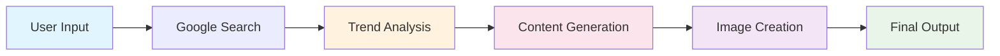

# 🚀 ABC Automation - AI-Powered Social Media Content Generator

<div align="center">


**An intelligent social media automation system that generates trending Facebook posts with custom AI-generated images**

[✨ Features](#-features) • [🛠️ Tech Stack](#️-tech-stack) • [⚡ Quick Start](#-quick-start) • [🔧 Configuration](#-configuration) • [📖 Usage](#-usage)

</div>

---

## 🌟 Overview

ABC Automation is a cutting-edge Next.js application that leverages AI to automatically generate engaging Facebook posts based on trending topics. The system combines intelligent web research, content generation, and custom image creation to produce professional social media content in seconds.

## ✨ Features

### 🎯 **Core Capabilities**

- **🔍 Trending Topic Research** - Automatically discovers the latest trends in any niche using Google Custom Search
- **📝 AI Content Generation** - Creates engaging Facebook posts using advanced LLM models
- **🎨 Custom Image Generation** - Produces relevant visuals using FLUX.1-schnell AI model
- **⚡ Real-time Processing** - Fast, efficient content generation with live progress tracking
- **🎨 Modern UI/UX** - Beautiful, responsive interface built with TailwindCSS

### 🤖 **AI-Powered Workflow**

1. **Research Phase** - Searches Google for trending topics in your specified niche
2. **Content Creation** - Generates compelling Facebook post content based on findings
3. **Visual Generation** - Creates matching images to accompany the post
4. **Instant Delivery** - Returns both text and image ready for social media posting

### 🛡️ **Production Ready**

- **Error Handling** - Comprehensive error management and user feedback
- **Type Safety** - Full TypeScript implementation
- **Responsive Design** - Works perfectly on desktop and mobile
- **Environment Security** - Secure API key management

---

## 🛠️ Tech Stack

<table>
<tr>
<td align="center"><strong>Frontend</strong></td>
<td align="center"><strong>Backend</strong></td>
<td align="center"><strong>AI & APIs</strong></td>
<td align="center"><strong>Styling</strong></td>
</tr>
<tr>
<td>

- **Next.js 15.4.5** - React Framework
- **React 19** - UI Library
- **TypeScript 5** - Type Safety

</td>
<td>

- **Next.js API Routes** - Backend Logic
- **LangChain 0.3.30** - AI Agent Framework
- **Zod 4.0** - Schema Validation

</td>
<td>

- **OpenRouter** - LLM Access (Gemini 2.0 Flash)
- **Together AI** - FLUX.1 Image Generation
- **Google Custom Search** - Trending Research

</td>
<td>

- **TailwindCSS 4** - Modern Styling
- **CSS Gradients** - Beautiful UI
- **Responsive Design** - Mobile First

</td>
</tr>
</table>

---

## ⚡ Quick Start

### 📋 Prerequisites

- **Node.js 18+** and **npm/pnpm**
- **OpenRouter API Key** ([Get free key](https://openrouter.ai/keys))
- **Together AI API Key** ([Get free key](https://api.together.xyz/settings/api-keys))
- **Google Custom Search API** ([Setup guide](https://developers.google.com/custom-search/v1/introduction))

### 🚀 Installation

```bash
# Clone the repository
git clone https://github.com/yourusername/abc-automation.git
cd abc-automation

# Install dependencies
npm install
# or
pnpm install

# Set up environment variables
cp .env.example .env.local

# Start development server
npm run dev
# or
pnpm dev
```

Visit [http://localhost:3000](http://localhost:3000) to see the application!

---

## 🔧 Configuration

### 🔑 Environment Variables

Create a `.env.local` file in the root directory:

```bash
# Required: OpenRouter API (FREE tier available)
OPENROUTER_API_KEY=your_openrouter_api_key_here

# Required: Together AI API (FREE FLUX.1 model)
TOGETHER_API_KEY=your_together_ai_api_key_here

# Required: Google Custom Search
GOOGLE_API_KEY=your_google_api_key_here
GOOGLE_CSE_ID=your_custom_search_engine_id_here
```

### 🎛️ API Configuration

| Service                  | Purpose                    | Cost                     | Setup Link                                                                 |
| ------------------------ | -------------------------- | ------------------------ | -------------------------------------------------------------------------- |
| **OpenRouter**           | LLM for content generation | FREE tier available      | [Get API Key](https://openrouter.ai/keys)                                  |
| **Together AI**          | FLUX.1 image generation    | FREE tier (5 images/day) | [Get API Key](https://api.together.xyz/settings/api-keys)                  |
| **Google Custom Search** | Trending topic research    | FREE (100 queries/day)   | [Setup Guide](https://developers.google.com/custom-search/v1/introduction) |

---

## 📖 Usage

### 🎯 Basic Usage

1. **Enter Your Niche** - Type any topic or industry (e.g., "Next.js", "AI", "Web Development")
2. **Click Generate** - The AI will research trending topics and create content
3. **Get Results** - Receive a complete Facebook post with matching image
4. **Copy & Post** - Use the generated content directly on your social media

### 🔄 AI Workflow



### 📱 Example Output

**Input:** `"Next.js"`

**Generated Post:**

```
🚀 Level Up Your Next.js Game with Server Components! 🚀

The Next.js App Router is a game-changer, and Server Components are at the heart of it! 💻
Learn how to build faster, more dynamic, and SEO-friendly applications.

✨ Benefits of Server Components:
- Improved performance
- Reduced client-side JavaScript
- Direct data fetching
- Enhanced security

Dive into the future of web development!
#Nextjs #React #ServerComponents #WebDev #Frontend #JavaScript
```

**Generated Image:** Custom AI-generated visual related to Next.js and server components

---

## 🎨 Customization

### 🔧 Modify AI Models

```typescript
// In app/api/agent/route.ts
const llm = ChatOpenRouter({
  modelName: "google/gemini-2.0-flash-exp:free", // Change model here
  apiKey: api_key,
});
```

### 🎭 Customize Post Style

Update the system prompt in `/app/api/agent/route.ts` to change:

- Writing tone and style
- Post structure and format
- Hashtag preferences
- Content length

### 🖼️ Image Generation Settings

```typescript
// In generateImageTool function
const response = await together.images.create({
  model: "black-forest-labs/FLUX.1-schnell-Free",
  prompt: `${prompt}`, // Customize prompt engineering
});
```

---

## 🚀 Deployment

### 📦 Build for Production

```bash
npm run build
npm start
```

### ☁️ Deploy to Vercel (Recommended)

[](https://vercel.com/new/clone?repository-url=https://github.com/yourusername/abc-automation)

1. Connect your GitHub repository
2. Add environment variables in Vercel dashboard
3. Deploy automatically

### 🐳 Deploy with Docker

```dockerfile
FROM node:18-alpine
WORKDIR /app
COPY package*.json ./
RUN npm ci --only=production
COPY . .
RUN npm run build
EXPOSE 3000
CMD ["npm", "start"]
```

---

## 🤝 Contributing

We welcome contributions! Here's how you can help:

### 🐛 Found a Bug?

- [Create an issue](https://github.com/shahriar-ridom/abc-automation/issues) with detailed description
- Include steps to reproduce and expected behavior

### 💡 Have an Idea?

- [Open a feature request](https://github.com/shahriar-ridom/abc-automation/issues)
- Explain the use case and potential implementation

### 🔧 Want to Code?

1. Fork the repository
2. Create a feature branch (`git checkout -b feature/amazing-feature`)
3. Commit your changes (`git commit -m 'Add amazing feature'`)
4. Push to the branch (`git push origin feature/amazing-feature`)
5. Open a Pull Request

---

## 📄 License

This project is licensed under the MIT License - see the [LICENSE](LICENSE) file for details.

---

## 🙏 Acknowledgments

- **OpenRouter** - For providing access to cutting-edge LLM models
- **Together AI** - For free FLUX.1 image generation capabilities
- **LangChain** - For the powerful AI agent framework
- **Next.js Team** - For the amazing React framework
- **Google** - For Custom Search API enabling trend research

---

## 📞 Support

Need help? We're here for you!

- 📧 **Email**: [shahriarridom.info@gmail.com](mailto:shahriarridom.info@gmail.com)
- 🐛 **Issues**: [Report bugs](https://github.com/shahriar-ridom/abc-automation/issues)

---

<div align="center">

**Made with ❤️ by [Shahriar Ridom](https://github.com/shahriar-ridom)**

⭐ **Star this repo if it helped you!** ⭐

</div>
